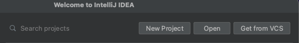
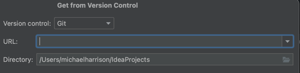
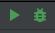
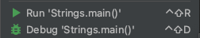
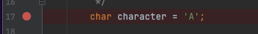
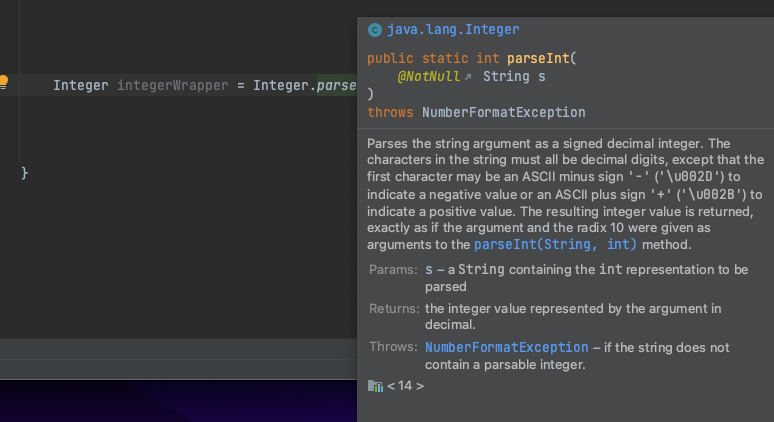

# Getting Started
* [Download Intellij IDEA](https://www.jetbrains.com/idea/download)
* Click the Get from VCS button
  * 
* Clone link : https://github.com/MHarrison72/intro-to-java.git
  * Enter this link in the text box
  * 

### Project Structure
* Start with /src/main/java/dataTypes
  * Characters.java
  * Strings.java
  * Integers.java
  * Doubles.java
  * BigDecimals.java
* Then /src/main/java/collections
  * Lists.java
  * Sets.java
  * Maps.java
* Then /src/main/java/loops
  * ForLoops.java
  * WhileLoops.java
* Then /src/main/java/files
  * ReadDataFromFile.java
  * WritingDataToFile.java

### Helpful Commands
* Run a class by using the green play button
* Debug a class by using the green bug button
  * 
    * These can be seen in the upper right
      <br/><br/>
  * 
    * These can be seen by Right-Clicking on a class
    <br/><br/>
* Add a Breakpoint by Left-Clicking next to the line number
  * 
    * Code execution will stop at these points when Debugging
      <br/><br/>
* Access JavaDoc by clicking on a class/method and pressing F1
  * 

### About
* indented under
  * multi level indent
* `quoted value`
* [README.md Markdown Documentation](https://www.jetbrains.com/help/idea/markdown.html)
```json
{
    "key" : "value"
}
```